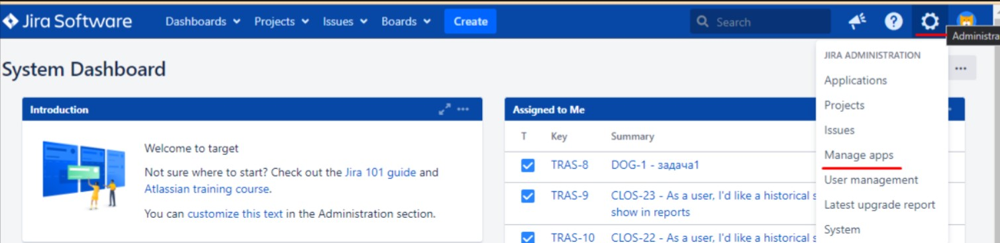
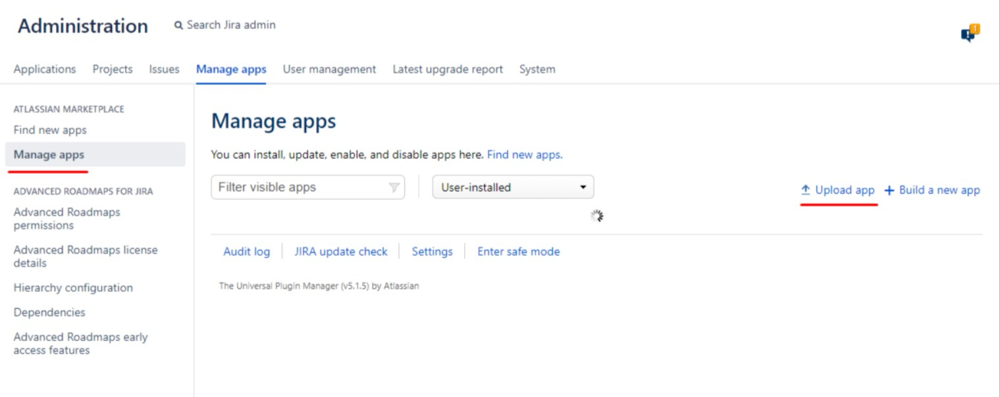
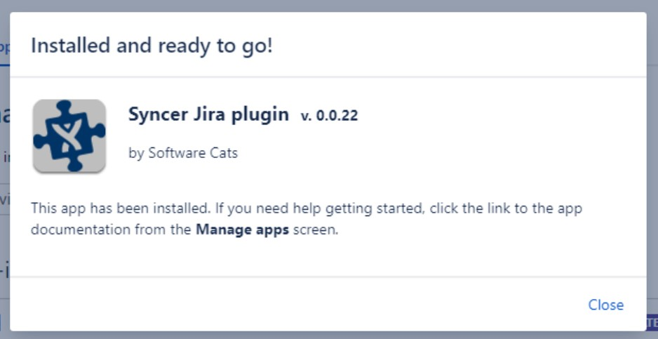
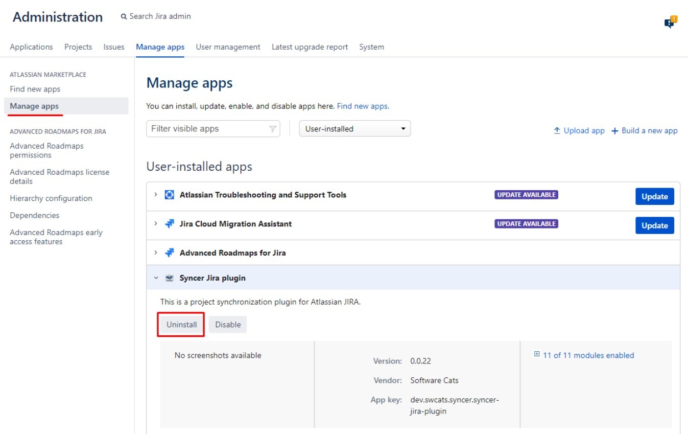
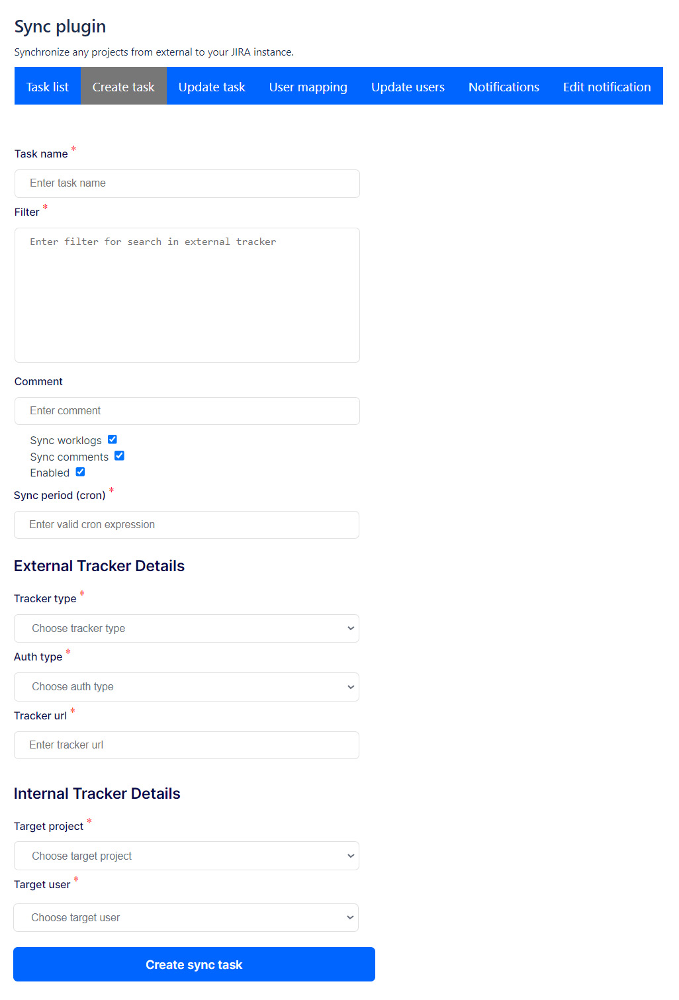
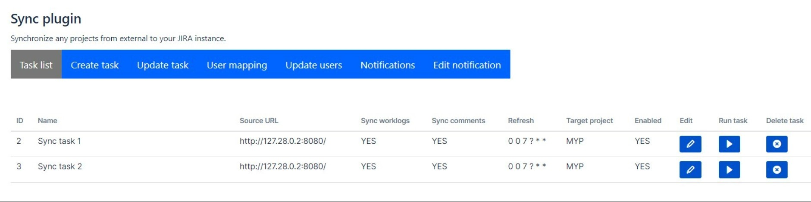
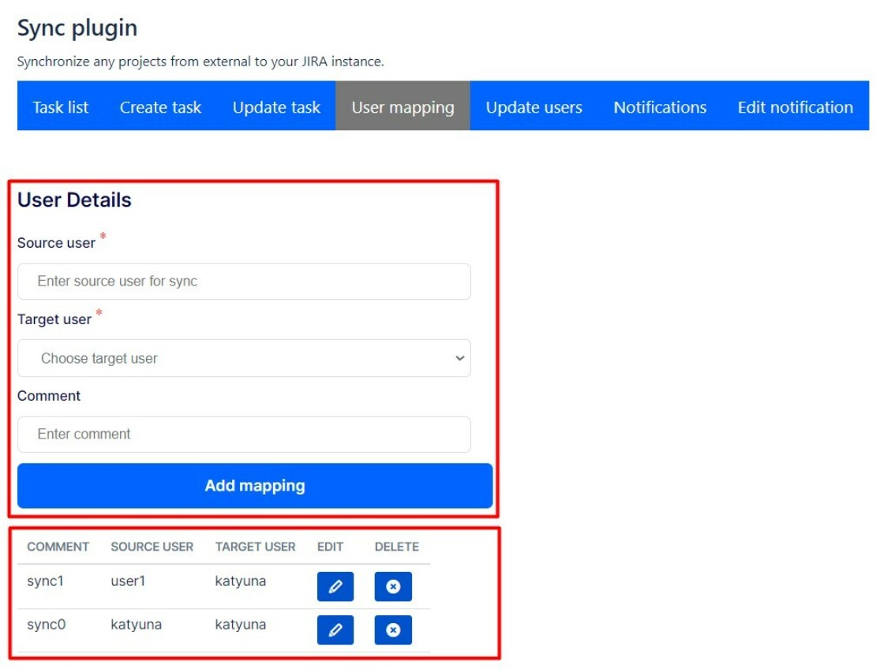
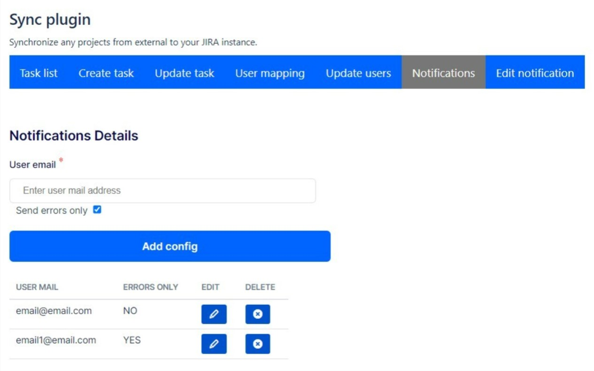
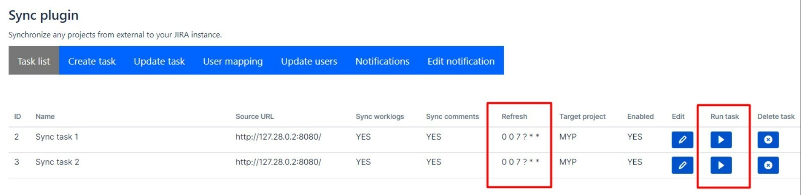
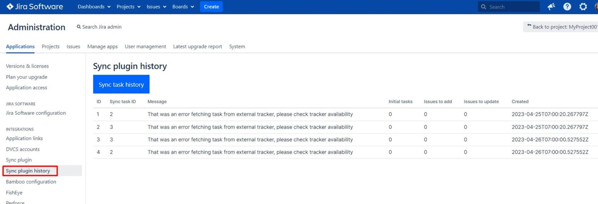

# Установка и настройка JIRA Syncer

Плагин помогает собрать все ворклоги из разных JIRA в одну.
- Синхронизация задач любого типа в тип Task.
- Синхронизация комментариев и ворклогов.
- Синхронизация “по кнопке”.
- Синхронизация по расписанию.
- Оповещение по email о синхронизации по расписанию.
- Настройка синхронизации с помощью JQL-выражений.
- История синхронизаций.

## Установка плагина
Перед установкой плагина, пожалуйста, ознакомьтесь с
[пользовательским соглашением](./Useragreement.md).

Плагин нужно установить в JIRA-приемник т.е. в ту JIRA, куда нужно перенести данные из 
JIRA-источников.

### Обновление плагина

Если в JIRA уже есть одна из предыдущих версий плагина, 
после установки новой версии плагин обновится, вся имеющаяся в нем информация сохранится.

### Установка плагина

1. Скачайте установочный jar-файл по ссылке в шапке сайта или в разделе "Цена".
2. Авторизуйтесь под ролью Администратор в JIRA-приемнике.
3. В меню с шестеренкой в верхнем правом углу экрана выберите пункт Manage Apps.

4. Нажмите Upload App и в открывшемся окне добавьте скачанный jar-файл с помощью кнопки выбора файла.

5. Дождитесь установки плагина и появления уведомления об успешной установке.

### Удаление плагина

1. Авторизуйтесь под ролью Администратор в JIRA-приемнике.
2. В меню с шестеренкой в верхнем правом углу экрана выберите пункт Manage Apps.
3. В списке слева выберите пункт Manage Apps.
4. В списке User-installed apps выберите Syncer Jira plugin.
5. Нажмите Uninstall.
6. Дождитесь удаления плагина и появления сообщения об успешном удалении.

**Внимание!** После удаления плагина все данные плагина (задачи на 
синхронизацию, маппинги и т.д.) удаляются, уже синхронизированные тикеты не 
удаляются.

## Настройка

Плагин предназначен для автоматизированной синхронизации задач JIRA – JIRA. 
На данный момент поддерживается синхронизация задач любого типа в тип Task из 
внешних JIRA (JIRA-источники) в JIRA с установленным плагином (JIRA-приемник).
Предусмотрено отключение синхронизации отдельно комментариев и отдельно ворклогов.

Дополнительно предусмотрено оповещение по email об успешном или неуспешном 
проведении синхронизации по расписанию.

Для отслеживания истории синхронизации используется модуль Sync plugin history.

Плагин не переносит изображения и вложенные файлы прикрепленные к тикету, 
ворклогу, комментарию.

### Доступ к плагину

Доступ к плагину осуществляется через меню Administration, раздел Applications. 
В списке слева выберите Sync Plugin, по умолчанию открывается список задач на синхронизацию.

Для того чтобы начать перенос данных из JIRA-источников в JIRA-приемник нужно 
создать задачи на синхронизацию и настроить маппинг пользователей.

### Создание задачи на синхронизацию_

Для создания задачи на синхронизацию нужно выбрать раздел "Create task" в верхней 
навигационной панели плагина, заполнить все обязательные поля и нажать кнопку 
"Create sync task". Обязательные поля обозначены красной звездочкой.

- Task name - может быть любым, но обязательно уникальным (не может быть 2-х 
  задач с одинаковыми названиями).
- Filter - фильтрация, выражение в формате JQL, которое определит какие тикеты из JIRA-источника переносить (например, фильтр "project = ONE" - перенесет все тикеты из проекта ONE JIRA-источника в JIRA-приемник).
- Comment - комментарий, необязательное поле.
- Sync worklogs - показывает нужно или нет при синхронизации переносить ворклоги.
- Sync comment - показывает нужно или нет при синхронизации переносить комментарии.
- Enabled - показывает включена или нет задача. 
- Если чек-бокс не выбран, то задача сохранится, но не будет запускаться, в любой момент задачу можно включить или выключить зайдя в режим редактирования задачи.
- Sync period (cron) - запуск задачи по расписанию (не работает в бесплатной версии плагина), выражение в формате jira cron, которое задает с какой периодичностью задача автоматически запускается.
- External tracker details - данные о JIRA-источнике. URL JIRA-источника, логин и пароль (или токен) пользователя. У пользователя должны быть права на чтение данных в проекте JIRA-источника откуда требуется перенести задачи, в идеале, он должен быть админом.
- Internal tracker details - данные о JIRA-приемнике.
- Target project - проект в JIRA-приемнике, в который будут переноситься тикеты из JIRA-источника.
- Target user - "базовый" пользователь JIRA-приемника. Если не настроен маппинг пользователей, то при синхронизации в него будут конвертироваться пользователи из JIRA-источника (для которых не настроен маппинг). Например, настроен маппинг для пользователя vasya в пользователя vasilii, а для пользователя petya маппинг не настроен. При синхронизации задача, назначенная на vasya c его же ворклогом, станет назначена на vasilii с ворклогом пользователя vasilii. Задача назначенная на petya с его же ворклогом будет назначена на "базового пользователя" как и ворклог, поскольку для этого пользователя не настроен маппинг.

### Список задач на синхронизацию

- ID - id задачи на синхронизацию (присваивается при создании задачи).
- Name - название задачи.
- Source URL - URL JIRA-источника.
- Sync worklogs
    - YES - если включена синхронизация ворклогов.
    - NO - если выключена синхронизация ворклогов.
- Sync comments
    - YES - если включена синхронизация комментариев
    - NO - если выключена синхронизация комментариев
- Refresh - крон-выражение, по которому запускается задача. **Не работает в бесплатной версии плагина**.
- Target project - проект в JIRA-приемнике, в который синхронизуются тикеты из JIRA-источника.
- Enabled
    - YES - если задача включена.
    - NO - если задача выключена и не синхронизирует данные.
- Edit - кнопка, открывающая режим редактирования задачи.
- Run task - кнопка для ручного запуска задачи на синхронизацию.
- Delete task - кнопка для удаления задачи.

### Редактирование и удаление задачи на синхронизацию

#### Редактирование в задачи на синхронизацию

Для того чтобы внести изменения в существующую задачу на синхронизацию:
1. В списке задач в строке с нужной задачей нажмите кнопку редактирования.
2. В открывшейся форме в разделе "Update task" внесите необходимые изменения в поля.
3. Нажмите кнопку "Update sync task".

#### Удаление задачи на синхронизацию

Удалить задачу на синхронизацию можно 2-мя способами:
1. Кнопкой "Delete sync task" в режиме редактирования задачи.
2. Кнопкой удаления в списке задач в разделе "Task list".

## Настройка маппинга пользователей
### Создание маппинга пользователей

Маппинг пользователей задается в разделе "User mapping" в верхней навигационной 
панели плагина.

В раздел "User mapping" находятся форма создания и список существующих маппингов. 
Список показывает как конвертируются пользователи JIRA-источника в пользователей 
JIRA-приемника при синхронизации.

Для создания нового маппинга нужно заполнить все обязательные поля и нажать кнопку "Add mapping".
Обязательные поля обозначены красной звездочкой.
- Source user - указать username пользователя внешней JIRA (username можно посмотреть в разделе User management администрирования внешней JIRA)
- Target user - выбрать username пользователя внутренней JIRA
- Comment - необязательное поле, в котором можно написать любую полезную информацию

**Внимание!**
Нельзя создать несколько маппингов с одинаковыми Source user, так как нельзя 
синхронизировать одного пользователя в несколько разных пользователей.
Можно создавать несколько маппингов с одинаковыми Target user, например, для 
того чтобы переносить данные одного пользователя из нескольких JIRA-источников 
в один JIRA-приемник.

### Список маппингов

- Comment - комментарий к маппингу
- Source user - username пользователя во внешнем трекере
- Target user - username соответствующего пользователя во внутреннем трекере
- Edit - кнопка открывающая режим редактирования маппинга
- Delete - кнопка для удаления маппинга

### Изменение маппинга пользователей

Для того чтобы внести изменения в существующий маппинг:
1. В списке в строке с нужным маппингом нажмите кнопку редактирования.
2. В открывшейся форме в разделе "Update user" внесите необходимые изменения.
3. Нажмите кнопку "Update user".

**Внимание!**
Плагин выдаст ошибку, если при внесении изменений в существующий маппинг в source user будет указан пользователь для которого уже есть маппинг.
Изменение в маппинге не повлияет на уже перенесенные ворклоги и комментарии (авторы синхронизированных до внесения изменений в маппинг ворклогов и комментариев останутся без изменений).

### Удаление маппинга пользователей

Удалить маппинг можно 2-мя способами:
1. Кнопкой "Delete user" в режиме редактирования маппинга.
2. Кнопкой удаления в списке маппингов в разделе "User mapping".

## Оповещение по email о результатах синхронизации
**Не работает в бесплатной версии плагина**

В платной версии плагина предусмотрено оповещение по email об успешном или неуспешном 
проведении синхронизации по расписанию.

Если задача на синхронизацию прошла успешно и в настройках включено email-оповещение 
об успешно проведенных задачах на синхронизацию, то всем пользователям, чьи почты 
прописаны в настройках плагина отправляется оповещение.

Если задача на синхронизацию прошла неуспешно и в настройках включено email-оповещение о неуспешно проведенных задачах на синхронизацию, то всем пользователям, чьи почты прописаны в настройках плагина отправляется оповещение.
Внимание! Оповещение работает только когда в JIRA-приемнике (JIRA, где установлен плагин) настроен сервер для исходящей почты.

Для того чтобы настроить оповещения о синхронизации нужно перейти в раздел 
"Notifications" верхней навигационной панели плагина.
По аналогии с маппингом в этом разделе отображается форма 
создания задач на оповещение и список существующих задач.

Для добавления нового email для отправки данных о синхронизации необходимо заполнить все обязательные поля и нажать кнопку "Add config".
Обязательные поля обозначены красной звездочкой.
User email - email, куда нужно отправлять отчеты о синхронизации.
Send errors only - получать только отчеты об ошибках в синхронизации, 
если чек-бокс отмечен; получать отчеты и об ошибках, и об успешных 
синхронизациях, если чек-бокс не отмечен.

#### Список задач на оповещение

- User mail - email для отправки отчетов
- Errors only
    - YES - отправляются уведомления только об ошибках.
    - NO - отправляются уведомления об ошибках и успешных синхронизациях.
- Edit - кнопка, открывающая режим редактирования условий оповещения.
- Delete - кнопка для удаления задачи.

#### Изменение задачи на оповещение

Для того чтобы внести изменения в существующую задачу необходимо:
1. В строке с нужной задачей в списке нажать кнопку редактирования.
2. В открывшейся форме в разделе "Edit notifications" внести необходимые 
   изменения в поля.
3. Нажать кнопку "Update config".

#### Удаление задачи на оповещение

Удалить задачу можно 2-мя способами:
1. Кнопкой "Delete config" в режиме редактирования задачи.
2. Кнопкой удаления в списке задач в разделе "Notifications".

## Особенности синхронизации

Задачи на синхронизацию запускаются:
- автоматически согласно времени заданному в поле Sync period (cron)- 
**не работает в бесплатной версии плагина**
- по кнопке Run в списке задач

Задача на синхронизацию переносит данные только тех тикетов, которые попали 
в фильтрацию, заданную в задаче (поле Filter - выражение в формате JQL).

Если 2 разные задачи на синхронизацию переносят одни и те же тикеты из JIRA-источника в один проект в JIRA-приемнике, то тикеты будут дублироваться, так как каждая задача при переносе создаст свои тикеты в JIRA-приемнике.

Плагин не переносит изображения и вложенные файлы прикрепленные к тикету, ворклогу, комментарию.

## История синхронизаций

История синхронизаций находится в меню Administration в разделе Applications, в списке слева - Sync plugin history.

Строка с информацией о синхронизации состоит из:
- ID - номер запуска синхронизации по порядку
- Sync task ID - id задачи на синхронизацию
- Message - информация о синхронизация
- Success - если синхронизация прошла успешно
- Текст ошибки (см ниже) - если во время синхронизации произошла ошибка
- Initial task - количество тикетов, которые попали в фильтрацию задачи на 
  синхронизацию
- Issues to add - количество тикетов, которые синхронизируются задачей в первый 
  раз (добавлены во внутренний трекер в эту синхронизацию)
- Issues to update - количество тикетов которые синхронизируются повторно.

## Ошибки

- No entries were found while fetching tasks. Please check the query or 
credentials - фильтрация в задаче на синхронизацию настроена правильно, но в нее не попадает ни один тикет из JIRA-источника.
- That was an error fetching task from external tracker, please check your 
  filter - фильтрация в задаче на синхронизацию настроена неправильно - JIRA-источник выдает ошибку при попытке поиска тикетов с такими условиями
- That was an error fetching task from external tracker, please check user 
  credentials - ошибка в настройке данных JIRA-источника в задаче на синхронизацию (логин, пароль, токен, url).
- That was an error fetching task from external tracker, please check user 
  access rights - в данных JIRA-источника в задаче на синхронизацию указаны логин/пароль или токен пользователя, у которого недостаточно прав на чтение данных, нужных для синхронизации.
- That was an error fetching task from external tracker, please check logs - 
  любые другие ошибки.